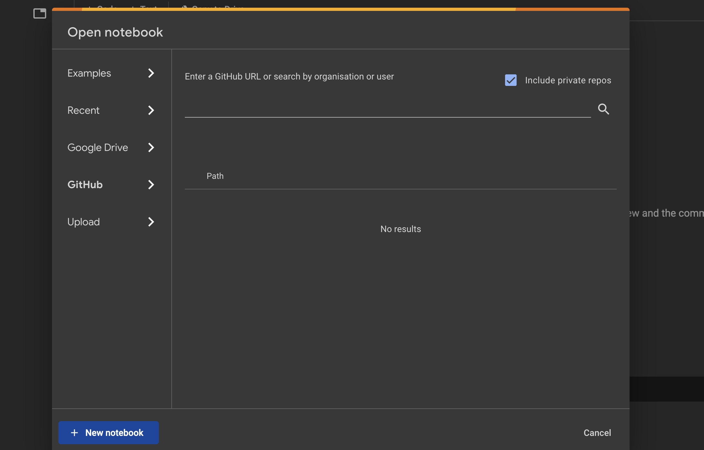
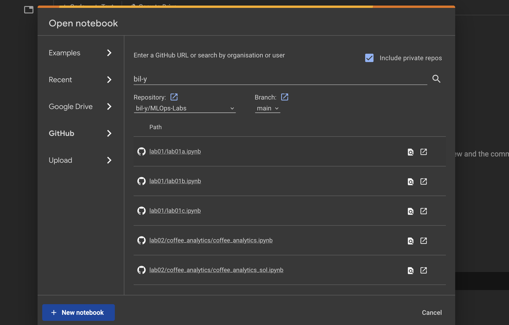
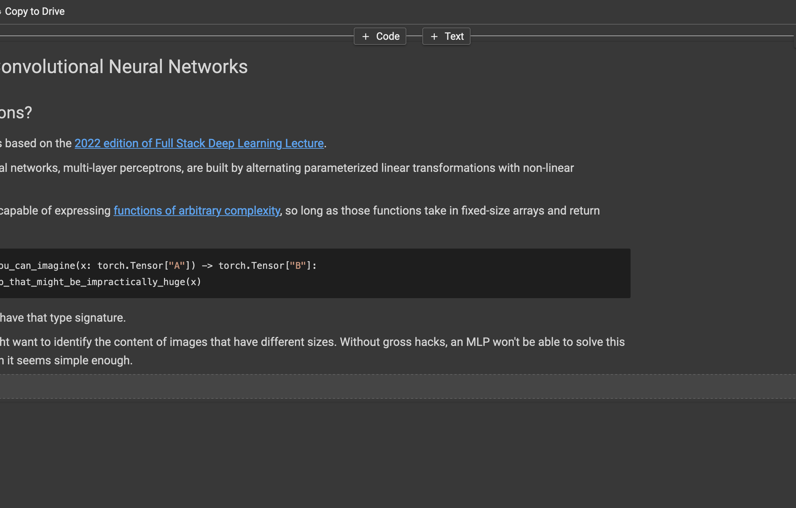
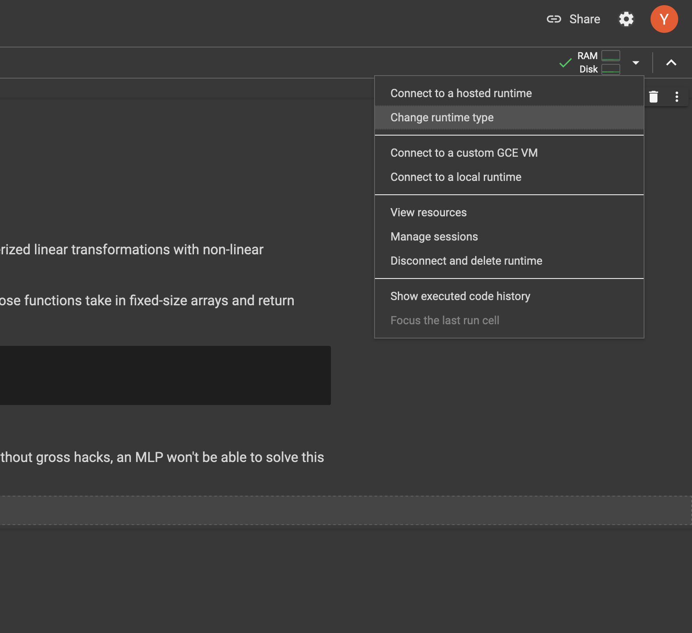

# MLOps

This is the repository for the labs/tutorials of the lecture Machine Learning Operations (MLOps), ZHAW BSc Computer Science & Data Science.

## Table of Contents

| Lab    | Contents                                                                                      | Link              |
| ------ | --------------------------------------------------------------------------------------------- | ----------------- |
| Lab 01 | Deep Learning recap: PyTorch, CNNs, Transformers                                              | [Lab 01](lab01/README.md) |
| Lab 02 | A chatbot with 🤗 Transformers and Streamlit                                                  | [Lab 02](lab02/README.md) |
| Lab 03 | Experiment management and hyperparameter tuning your own diffusion model.                     | [Lab 03](lab03/README.md) |
| Lab 04 | CI/CD for code, models, and data.                                                             | [Lab 04](lab04/README) |
| Lab 05 | From notebooks to pipelines to batch processing: A coffee analytics case study in three acts. | [Lab 05](lab05/README.md) |
| Lab 06 | _Coming soon_                                                                                 | [Lab 06](lab06/README.md) |
| Lab 07 | _Coming soon_                                                                                 | [Lab 07](lab07/README.md) |

## Setup

We use `conda` environments to manage the lab dependencies. Every lab has its own conda environment. Install [Anaconda](https://www.anaconda.com/download/), [Miniconda](https://docs.conda.io/projects/miniconda/en/latest/miniconda-install.html) or [Mamba](https://mamba.readthedocs.io/en/latest/) for your platform.

We further recommend **Windows Users** to use the [Windows Subsystem for Linux (WSL)](https://learn.microsoft.com/en-us/windows/wsl/install) as some software we are using does not support Windows.

Finally, it is a good idea to install [Docker Desktop](https://www.docker.com/products/docker-desktop/) as some of the labs contain parts that _benefit_ from Docker (it is not a requirement, though).

### Creating environments with `conda`

Once you have conda installed, you can create an environment from a `env.yaml` file using the following command:

```shell
conda env create -f env.yaml
```

Then, to enter the environment:

```shell
conda activate <environment name>
```

So, for the first lab this command becomes:

```shell
conda activate mlops-lab-01
```

### Running Notebooks

Most labs will make use of [Jupyter Notebooks](https://jupyter.org/), which you can either run locally or on Google Colab. There are of course many other ways to run them, and you are free to use whichever tool and setup you want, but we cannot guarantee compatibility.

Below we show you two ways of running the lab notebooks that are known to work.

#### Running locally

To run notebooks locally, proceed as follows:

1. Open a terminal and navigate to the lab directory (e.g. `lab01`).
2. Activate the conda environment for this labe (e.g. `mlops-lab-01`).
3. Run `jupyter lab`. This will result in output similar to the following:

```shell

    To access the server, open this file in a browser:
        file:///some/long/path/here/jpserver-74325-open.html
    Or copy and paste one of these URLs:
        http://localhost:8888/lab?token=token
        http://127.0.0.1:8888/lab?token=token
```

4. Click on or copy the link and past it in your browser.
5. Now, click on the jupyter notebook of your liking.

#### Running in Google Colab

TODO: Paste actual PAT!

1. Navigate your browser to [colab.research.google.com](colab.research.google.com).
2. When prompted to open a notebook, select **GitHub**
   
3. Copy the following URL into the search bar: `https://token@github.com/bil-y/MLOps_Bsc`.
4. The screen should now look something like the image below:
   
5. Select the notebook you want to open.
6. Once your notebook is open, add a code cell at the very top. You can do this, hover your cursor over the top of the notebook like in the image below:
   

7. In the code cell, add the following:

```shell
!git clone https://token@github.com/bil-y/MLOps_Bsc
%cd MLOps_Bsc/path/to/notebook
```

where you replace `path/to/notebook` with the path to the jupyter notebook you just opened. For instance, if you opened `lab01a.ipynb`, the statement would become `%cd MLOps_Bsc/lab01`.

8. Connect to a GPU by changing the runtime type:
   
