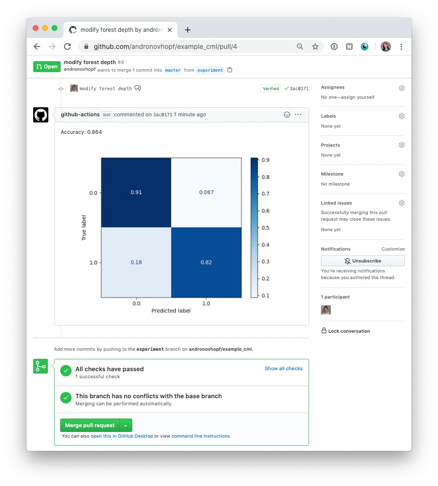

# CI/CD for machine learning models

So far, we have been writing pipelines and tests for the model _code_ - but what about the (trained) models? In this part, we look at how CI/CD can be extended to the aspects of machine learning that are beyond coding.
For ML models, CI/CD concepts can be utilized to streamline the process of model training (and retraining), data and model validation and model deployment:

- Data integrity validation: Assure that the data does not contain errors or suffer from problems introduced during the data gathering process (e.g. bugs in the data processing pipeline or changes in the data source).
- Dataset comparisons: Assure that the dataset is not drifting / spot data drift early.
- Model training: Automate the model's training procedure on new (validated) training data.
- Model validation: Evaluate the model's performance, calibrating model predictions, and identifying weak segments.
- Model deployment: Upload your model to a model registry and connect it to a production environment.

Here, we focus on CI for model training and validation. Data and deployment will be discussed in the upcoming labs.

## How to test a model

If you have ever taken a course on machine learning, you are likely familiar with the concept of a _test_ set. If not: A test set is a portion of the dataset that is held out from the training process and used to evaluate the _performance_ of a trained model. The test set serves as an independent dataset to assess how well the model generalizes to new, unseen data. Typically, this looks something like the snippet below.

```python
from sklearn.datasets import load_iris
from sklearn.model_selection import train_test_split
from sklearn.linear_model import LogisticRegression
from sklearn.metrics import accuracy_score

# Load your dataset
iris = load_iris()
X = iris.data
y = iris.target

# Split data into train and test sets
X_train, X_test, y_train, y_test = train_test_split(X, y, test_size=0.2, random_state=42)

# Train the model
model = LogisticRegression()
model.fit(X_train, y_train)

# Predictions on the test set
y_pred = model.predict(X_test)

# Evaluate the model
accuracy = accuracy_score(y_test, y_pred)
print("Accuracy on test set:", accuracy)
```

You might be inclined to say that you do not need a pipeline for this - and you'd be right!
But this is really only the beginning, especially as the models become more complex, more aspects become relevant:

- Does your model perform equally well on all subsets (segments) of the data?
- Are there unused features?
- Is the model inference time increasing?
- ... and many more.

Luckily, there are tools that give you a helping hand when it comes to creating test suites for your machine learning models. Here, we will work with [deepchecks](https://docs.deepchecks.com/stable/getting-started/welcome.html). In their own words,

> Deepchecks is a holistic open-source solution for all of your AI & ML validation needs, enabling you to thoroughly test your data and models from research to production.

### Testing models with Deepchecks

Deepchecks implements _test suites_ for your models. A test suite consists of one or more _checks_.

As almost any other package, you install `deepchecks` via `pip`:

```shell
pip install deepchecks
```

but you don't have to do that because we already took care of installing it for you in the environment.

Deepchecks comes with pre-built suites for _tabular_, _nlp_, and _vision tasks_. For each task, there are three suites available:

- `data_integrity`: A suite to detect data integrity issues like missing labels, duplicates, or conflicting labels.
- `train_test_validation`: A suite for validating the correctness of train-test split, including distribution, leakage and integrity checks.
- `model_evaluation`: A suite for evaluating the model's performance over different metrics, segments, error analysis, examining overfitting, comparing to baseline, and more.

Of course, you can write your own checks and suites if you chose so. You can also implement new tasks - but more on this later. Here we are going to use one of Deepchecks' prebuilt suites to test a computer vision model.

In `lab04/deepchecks_intro` you find a small demo project that trains a binary classification (Ants vs Bees) model on the  `hymenoptera` dataset that you have already encountered in the first lab. The project consists of the following files:

- `data.py`: Downloads and unpacks the training data.
- `train.py`: Trains the model.
- `test.py`: Runs the deepchecks test suite.

Take a quick look a `data.py` and `train.py` - nothing should surprise you.

Before we can look at the contents `test.py`, we have to introduce you to a standard feature of [PyTorch data loaders](https://pytorch.org/docs/stable/data.html#torch.utils.data.DataLoader) that you are perhaps unaware of.
If you look at the signature

> torch.utils.data.DataLoader(dataset, batch_size=1, shuffle=None, sampler=None, batch_sampler=None, num_workers=0, **collate_fn=None**, pin_memory=False, drop_last=False, timeout=0, worker_init_fn=None, multiprocessing_context=None, generator=None, *, prefetch_factor=None, persistent_workers=False, pin_memory_device='')

there's something called a `collate_fn`. What's that? The PyTorch documentation is slightly cryptic, telling us that it

> merges a list of samples to form a mini-batch of Tensor(s). Used when using batched loading from a map-style dataset.

What they are trying to tell us is that the collate function can be used to transform the output batch to any custom format. Here's an example where we use the collate function to stack images along the batch dimension:

```python
import torch
from torch.utils.data import DataLoader, Dataset
from torchvision import transforms
from PIL import Image
import os

class CustomDataset(Dataset):
    def __init__(self, data_dir, transform=None):
        self.data_dir = data_dir
        self.transform = transform
        self.image_files = os.listdir(data_dir)

    def __len__(self):
        return len(self.image_files)

    def __getitem__(self, idx):
        img_name = os.path.join(self.data_dir, self.image_files[idx])
        image = Image.open(img_name)
        if self.transform:
            image = self.transform(image)
        return image

# Define a collate function to handle batch processing
def custom_collate(batch):
    # Stack the images in the batch along the batch dimension
    # This assumes that all images are of the same size
    return torch.stack(batch)

# Create a custom dataset instance
data_dir = "path/to/your/dataset"
custom_dataset = CustomDataset(data_dir, transform=transform)

# Create a DataLoader with custom collate function
# The collate_fn argument is used to specify how batches are formed
# In this case, we use our custom_collate function
dataloader = DataLoader(custom_dataset, batch_size=4, shuffle=True, collate_fn=custom_collate)
```

Why do we need this? Deepchecks checks validate the model & data by calculating various quantities over the data, labels and predictions. In order to do that, those must be in a pre-defined format, according to the task type. This format depends on the task and data your are trying to test. Deepchecks provides data classes for [tabular](https://docs.deepchecks.com/stable/api/deepchecks.tabular.html#deepchecks.tabular.Dataset), [text](https://docs.deepchecks.com/stable/nlp/usage_guides/text_data_object.html), and [vision (i.e. image) data](https://docs.deepchecks.com/stable/vision/usage_guides/visiondata_object.html#vision-vision-data-class). As we are working with image data, we will be using the vision data class, aptly named [`VisionData`](https://docs.deepchecks.com/stable/vision/usage_guides/visiondata_object.html#vision-vision-data-class).

Deepchecks data classes can be constructed from a other objects like PyTorch `DataLoader`s or Tensorflow `Dataset`s, but we have to make their output match the output that the data class expects. This is where the collat function comes into play, we use it to transform the batch to the correct format for the checks.

The expected data format for vision [is documented here](https://docs.deepchecks.com/stable/vision/usage_guides/supported_tasks_and_formats.html#supported-tasks-and-formats). Deepchecks expects a dictionary of the following form for each batch:

```python
{
    'images': [image1, image2, ...],
    'labels': [label1, label2, ...],
    'predictions': [prediction1, prediction2, ...],
    'image_identifiers': [image_identifier1, image_identifier2, ...]
}
```

Because dictionaries are not self-documenting, it's better to use the `BatchOutputFormat` helper class provided by deepchecks:

```python
BatchOutputFormat(
    images=[image1, image2, ...],
    labels=[label1, label2, ...],
    predictions=[prediction1, prediction2, ...],
    image_identifiers=[image_identifier1, image_identifier2, ...]
)
```

Note that the list of required entries depends on the suite you want to run. For data_integrity checks, you don't need predictions. Similarly, the format of each entry depends on the task your model performs: For classification, each element in `predictions` should be an array of logits, while for object detection, each element should be a tuple `(x_min, y_min, w, h, confidence, class_id)`. The exact requirements for each built-in task are defined [here](https://docs.deepchecks.com/stable/vision/usage_guides/supported_tasks_and_formats.html#classification).

We will be running the `model_evaluation` suite, hence we _need_ predictions.
So, for our (binary) image classification task, a collate function that converts the data into the correct format could look as follows:

```python
def collate_fn(batch) -> BatchOutputFormat:
    """Return a batch of images, labels and predictions for a batch of data. The expected format is a dictionary with
    the following keys: 'images', 'labels' and 'predictions', each value is in the deepchecks format for the task.
    You can also use the BatchOutputFormat class to create the output.
    """
    # batch received as iterable of tuples of (image, label) and transformed to tuple of iterables of images and labels:
    batch = tuple(zip(*batch))

    # images:
    inp = torch.stack(batch[0]).detach().numpy().transpose((0, 2, 3, 1))
    mean = [0.485, 0.456, 0.406]
    std = [0.229, 0.224, 0.225]
    inp = std * inp + mean
    images = np.clip(inp, 0, 1) * 255

    # labels:
    labels = batch[1]

    # predictions:
    logits = model.to(device)(torch.stack(batch[0]).to(device))
    predictions = nn.Softmax(dim=1)(logits)
    return BatchOutputFormat(images=images, labels=labels, predictions=predictions)
```

(In `test.py` we construct this function using another function that takes `model` and `device` as an argument. This pattern is described [here](https://docs.deepchecks.com/stable/vision/usage_guides/visiondata_object.html#on-demand-inference).)

Our collate function does the following:

1. Reshape the batch that we get from the data loader.
2. "De-normalize" the images by rescaling them with the dataset standard deviation and adding the mean.
3. Extract the ground-truth labels.
4. Perform inference to obain the
5. Return a `BatchOutputFormat`.

Using the collate function is as easy as passing it to the DataLoader. Taken from `test.py`:

```python
test_dataset = AntsBeesDataset(root=os.path.join(data_dir, "val"))
test_loader = DataLoader(
  test_loader, batch_size=64, shuffle=False, collate_fn=collate_fn
)
```

Then, building the `VisionData` object is just a constructor call away:

```python
test_data = VisionData(test_loader, task_type='classification')
```

Running the test suite is just two lines of code away:

```python
suite = model_evaluation()
result = suite.run(test_data, max_samples = 5000)
```

Now you show know everything to understand `test.py`. Take a look and run it.
`test.py` will generate a report for you to inspect! As you can see, the model isn't particularly good - but that's also not the point of this exercise. 😉

### Your turn: Integrate deepchecks into a GitHub Actions Pipeline

Now it's your turn: Combine your knowledge from the previous parts and implement a GitHub actions workflow that executes the whole pipeline (`data.py`, `train.py`, and `test.py`). You can use `deepchecks_intro/workflows/deepchecks.yaml` as a starting point.

## Testing beyond performance

Predictive performance is not the only property that matters. In fact, there are _many_ more things that a model can and should be tested on. Testing for properties like explainability, robustness, or fairness is crucial before a model can be brought into contact with the real world.

Here, we are going to test a model's robustness to perturbations. We will do this by performing _adversarial attacks_.

Adversarial examples are inputs to machine learning models that are designed to cause the model to make a mistake, they’re like optical illusions for machines. A frequently cited example is the following image from [Explaining and Harnessing Adversarial Examples](https://arxiv.org/abs/1412.6572):


An attacker adds a small amount of noise to an image and passes it to the neural network, which causes the model to mistake the panda for a gibbon (note the high confidence!). There exist _numerous_ methods for constructing adversarial examples. Here, we'll use the same method that was also used to create the example above, the _Fast Gradient Sign Method_ (FGSM).

The idea behind FGSM is simple: We do the opposite of gradient descent. That is, we evaluate the model for some input, compute the loss function, and then take the gradient with respect to the input. Instead of moving in the direction that minimizes the gradient, we aim to _maximize_ it.  Mathematically, this looks as follows. First, we compute the perturbation $\eta$:

$$\eta = \epsilon \cdot \operatorname{sign}(\nabla_x L(\operatorname{NN}_w(x), y))$$

Here, $L$ denotes the loss function.
Then, the adversarial example is obtain by adding the perturbation to the input:

$$\tilde{x} = x + \eta$$

In PyTorch code, the procedure looks as follows:

```python
def fgsm_attack(x, epsilon):
    x_tilde = x + epsilon * x.grad.data.sign()
    x_tilde = torch.clamp(x, 0, 1)
    return x_tilde
```

To attack a model, you can use `fgsm_attack` like in the example below.

```python
epsilon = 1e-4
image, label  = ... # Get image and label from somewhere.
output = model(image)

# This could be any loss function.
loss = F.nll_loss(output, label)
model.zero_grad()
loss.backward()

# Attack!
perturbed_image = fgsm_attack(image, epsilon)
perturbed_output = model(perturbed_image)
```

### A custom deepchecks check

As mentioned previously, you can extend deepchecks with your own checks and suites. In the final part of this lab, you are going to develop a check that tests a model's robustness to adversarial attacks.

In deepchecks, `Check`s are child classes that inherit form one of multiple check base classes.
The first step when writing a check is to decide which of the built-in deepcheck check base class to use. You can read more in the [Base Checks Types section](https://docs.deepchecks.com/stable/vision/auto_tutorials/other/plot_custom_checks.html#base-checks-types) of their docs. In our case, we want a check the uses both the model and the data, so we will be using the `SingleDatasetCheck`. This base class requires us to implement

- `initialize_run`, which initializes the run before starting updating on batches. Optional.
- `update`, which is used for actions that are to be performed on each batch. This method is intended to update the internal state of the check.
- `compute`, which computes the final check result based on accumulated internal state.

#### Helper classes

The three methods of the check - `initialize_run`, `update` and `compute`, utilize the `Context` and `Batch` objects.

The `Context` object contains the basic objects deepchecks uses - the train and test VisionData objects, and the use model itself. The `Batch` objects contains processed data from the dataloader, such as the images, labels and model predictions.

For more examples of using the Context and Batch objects for different types of base checks, see the Custom Check Templates guide.

You can find a skeleton in `deepchecks_advanced/check_attack.py`. Follow the instructions given in the file to implement the check. Then, use your new check in `deepchecks_advanced/test.py`. Again, follow the `TODO`s.

---

## Further reading

### More on adversarial attacks

If you would like to learn more about adversarial attacks, we recommend the [Adversarial Machine Learning Reading List](https://nicholas.carlini.com/writing/2018/adversarial-machine-learning-reading-list.html) by Nicholas Carlini, a leading researcher on this topic.

### More on testing beyond performance

As mentioned above, predictive performance is not the only property that matters. If you would like to see a concrete

### Improved Tooling for continuous integration and delivery of machine learning models

The final two sections introduce you to two tools that enhance CI/CD pipelines for machine learning systems.

####  Continuous machine learning with CML

[Continuous Machine Learning (CML)](https://cml.dev) is a tool that extends common CI/CD solutions (GitHub Actions, GitLab CI/CD, and even Bitbucket Pipelines) to machine learning. The idea behind CML is that you use the CI/CD pipeline for training and evaluating your models in the same way that you use them to build and test your code. The `deepchecks` pipeline from above could be enhanced as follows:

Deepchecks can export a CML report. All that one has to change is to add the following line:

```python
result.save_as_cml_markdown(file='report.md', format='github')
```

Then, to actually use `cml`, we can use their GitHub Action in our workflow:
```yaml
name: CML
on: [push]
jobs:
  train-and-report:
    runs-on: ubuntu-latest
    # optionally use a convenient Ubuntu LTS + DVC + CML container
    # container: docker://ghcr.io/iterative/cml:0-dvc2-base1
    steps:
      # may need to setup Node.js & Python3 on e.g. self-hosted
      # - uses: actions/setup-node@v2
      #   with:
      #     node-version: '16'
      # - uses: actions/setup-python@v4
      #   with:
      #     python-version: '3.x'
      - uses: iterative/setup-cml@v1
      - uses: actions/checkout@v3
      - name: Train model
        run: |
          # Your ML workflow goes here
          pip install -r requirements.txt
          python train.py
      - name: Create CML report
        env:
          REPO_TOKEN: ${{ secrets.GITHUB_TOKEN }}
        run: |
          python test.py
          # Post CML report as a comment in GitHub
          cml comment create report.md
```

This workflow does the following:

1. Set up CML in the GitHub actions workflow.
2. Checkout the code.
3. Install dependencies and execute `train.py`.
4. Run `test.py` and report the metrics and plots created during training to GitHub.

The only part where CML really comes into play here is the last step: CML makes it easy to generate reports in response to changes. `cml comment create` posts a markdown report as a comment on a commit, pull/merge request, or issue. The result looks like the image below.



[CML also comes with utilities to launch dedicated runners](https://cml.dev/doc/ref/runner) for the workflow - this is especially useful when using CML for neural networks as GitHub's runners do not come with GPUs.
However, the tool introduced next sections specializes in this discipline!

#### SkyPilot: Abstract away the infrastructure

GitHub's runners don't have GPUs, so training neural networks in the GitHub Actions CI/CD is not possible.
You could of course host your own runner on some server with GPUs. This can be very cumbersome when done manually. _SkyPilot_ is a tool that can help you overcome this issue.

In their own words,
> SkyPilot is a framework for running LLMs, AI, and batch jobs on any cloud, offering maximum cost savings, highest GPU availability, and managed execution.

SkyPilot abstracts away the cloud infrastructure (deploying VMs or clusters, allocating storage, etc) and provides a unified interface to launch jobs on this infrastructure. A SkyPilot _task_ specifies: resource requirements, data to be synced, setup commands, and the task commands. Once written, the task can be launched on any available cloud.

Using SkyPilot, the training job in our pipeline from above would looks something like the yaml snippet below:

```yaml
# Declare which resources (e.g. GPUs you want)
resources:
  accelerators: V100:1  # 1x NVIDIA V100 GPU

# Say how many nodes you need.
num_nodes: 1  # Number of VMs to launch

# Working directory (optional) containing the project codebase.
# Its contents are synced to ~/sky_workdir/ on the cluster.
workdir: ~/deepchecks_advanced

# Commands to be run before executing the job.
# Typical use: pip install -r requirements.txt, git clone, etc.
setup: |
  pip install "torch torch-vision deepchecks"

# Commands to run as a job.
# Typical use: launch the main program.
run: |
  python train.py
  python test.py
```

Then, the workflow becomes:

```yaml
name: CML
on: [push]
jobs:
  train-and-report:
    runs-on: ubuntu-latest
    # optionally use a convenient Ubuntu LTS + DVC + CML container
    # container: docker://ghcr.io/iterative/cml:0-dvc2-base1
    steps:
      # may need to setup Node.js & Python3 on e.g. self-hosted
      # - uses: actions/setup-node@v2
      #   with:
      #     node-version: '16'
      # - uses: actions/setup-python@v4
      #   with:
      #     python-version: '3.x'
      - uses: iterative/setup-cml@v1
      - uses: actions/checkout@v3
      - name: Train model
        run: sky launch task.yaml
      - name: Create CML report
        env:
          REPO_TOKEN: ${{ secrets.GITHUB_TOKEN }}
        run: |
          # Post CML report as a comment in GitHub
          cml comment create report.md
```
