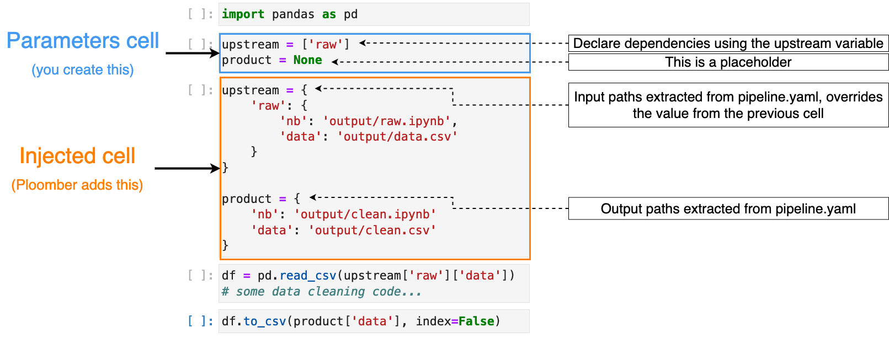

# Ploombing 101

###### This introduction to Ploomber is based on the [official Ploomber documentation](https://docs.ploomber.io/en/latest)

## Learning Goals

1. Basic concepts of Ploomber (and pipelines in general)
2. Building Ploomber pipelines
3. Refactoring legacy notebooks / pipelines

## Basic concepts of Ploomber

Until now, our discussion has centered around _pipelines_ without providing a clear definition of the term. In essence, a pipeline is a sequence of processing elements (such as processes, threads, coroutines, functions, etc.) organized in such a way that the output of each element serves as the input for the next one[1]. From a mathematical perspective, a pipeline forms a directed acyclic graph (DAG), where the nodes represent the processing elements, and the edges represent the flow of data.

Ploomber enables the swift transformation of a set of scripts, notebooks, or functions (i.e., the processing elements or nodes of the DAG) into a data pipeline by adhering to three conventions:

- Each task is a function, script, or notebook.
- Tasks specify their dependencies using an upstream variable.
- Tasks specify their outputs using a product variable.

### A simple pipeline

Suppose we aim to construct a pipeline for visualizing data. Instead of consolidating all the code into a single file, we opt to divide the logic into three distinct steps. This approach enhances the maintainability of our code and facilitates testing.


Within a Ploomber pipeline, the outputs (referred to as products) generated by one task serve as inputs for subsequent "downstream" tasks. Consequently, the flow of "upstream" dependencies follows a left-to-right progression. For instance, in the given pipeline, `Load` is an "upstream" dependency for the `Clean` task.

An "upstream" dependency signifies that a particular task utilizes the products of its upstream tasks as inputs. Following the pipeline example, the `Clean` task utilizes the products of the `Load` task, while the `Plot` task utilizes the products of the `Clean` task.

Ploomber supports four types of tasks:

- Python functions (also known as callables)
- Python scripts/notebooks ([and their R equivalents](https://docs.ploomber.io/en/latest/user-guide/r-support.html))
- [SQL scripts](https://docs.ploomber.io/en/latest/get-started/sql-pipeline.html)
- [Shell scripts](https://docs.ploomber.io/en/latest/user-guide/shell.html)

You can mix any combination of tasks in your pipeline. For example, you can load data with an SQL query, then plot it with Python.

### Defining a pipeline

To execute a pipeline, Ploomber needs to know the location of the task’s source code (source key), and the location of the task’s products (product key). You can do this via a pipeline.yaml file:

```yaml
tasks:
  # this is a sql script task
  - source: raw.sql
    product: [schema, name, table]
    # ...

  # this is a function task
  # "my_functions.clean" is equivalent to: from my_functions import clean
  - source: my_functions.clean
    product: output/clean.csv

  # this is a script task (notebooks work the same)
  - source: plot.py
    product:
      # scripts always generate a notebook (more on this in the next section)
      nb: output/plots.ipynb
```

Once you have a pipeline.yaml file, you can run it with:

```shell
ploomber build
```

Ploomber keeps track of source changes to skip up-to-date tasks. If you run `ploomber build` again, only tasks whose source code has changed are executed. This helps iterate faster, as changes to the pipeline only trigger the least number of tasks. You can also instruct ploomber to track the content of other files by using the `resources_` section.

You can make ploomber draw a graph of the pipeline using

```shell
ploomber plot
```

While this section covers everything that we need for the purpose of this lab, there is much more to be learned about the `pipeline.yaml` specification. See Ploomber's documentation for a [full reference](https://docs.ploomber.io/en/latest/api/spec.html).

### Tasks: Scripts & Notebooks

One way of specifying tasks is using scripts or notebooks. You can find an example pipeline to follow along in `5/ploomber/scripts`.

Jupyter notebooks files (.ipynb) contain both code and output; while convenient, keeping code and outputs in the same file makes version control (i.e., git) difficult. Ploomber thus recommends using scripts but will copy and convert your scripts to notebooks. This allows you to still have the benefits on notebooks when debugging the pipeline.

Ploomber further recommends using `# %%` comments to group parts of your script into notebook cells:

> The `# %%` is one way of representing `.py` as notebooks. Ploomber uses jupytext to perform the conversion, other formats such as the “light” (`# +`) format work too. Editors such as VS Code, Spyder, and PyCharm support the “percent” format.


#### `upstream` and `product`

To specify task dependencies, include a special `parameters` cell in your script/notebook. Following the example pipeline, clean has raw as an upstream dependency as the raw task is an input to the clean task. We establish this relation by declaring an upstream variable with a list of task names that should execute before the file we’re editing. If a script/notebook has no dependencies, set upstream = None.

```python
# %% tags=["parameters"]
upstream = ['raw'] # this means: execute raw.py, then clean.py
product = None
```

> Important: `product = None` is a placeholder. It states that our script takes an input parameter called product, but the actual value is automatically replaced at runtime, we explain this in the upcoming section.
> The `# %%` markers only apply to scripts. Click here for information on adding tags to .ipynb files.

This code will break if we run it: We specified 'raw' as an upstream dependency, but we lack information on where to retrieve our inputs or store our outputs.

During the execution of your pipeline, Ploomber introduces a new cell into each script or notebook. This cell contains updated product and upstream variables, replacing the original ones by extracting information from the pipeline.yaml:


Image taken from Ploomber docs.

As you can see in the image, the task shown has `raw` as an upstream dependency. The newly introduced cell contains a dictionary providing the outcomes of the `raw` task, utilized as input, along with a new product variable to retain our generated results.

Since scripts/notebooks always create an executed notebook, you must specify where to save such a file. A typical task declaration looks like this:

```yaml
tasks:
  - source: plot.py
    # output notebook
    product: output/plots.ipynb
```

If your task generates multiple outputs, you can create a dictionary in the  `product` section:

```yaml
tasks:
  - source: plot.py
    product:
      # if the script generates other products, use "nb" for the notebook
      nb: output/plots.ipynb
      # ...and any other keys for other files
      data: output/data.csv
```

### Tasks: Functions

Functions can be tasks too!

You can find an example pipeline to follow along in `lab05/ploomber/functions`.

#### `upstream` and `product`

The only requirement for a function to be a valid task is to have a product parameter.

```python
import pandas as pd

def clean(product):
   # save output using the product argument
   df.to_csv(product)
```

If the task has upstream dependencies, add an upstream parameter.

```python
import pandas as pd

def clean(product, upstream):
   df_input = pd.read_csv(upstream['my_little_upstream_task'])
   df.to_csv(product)
```

> When resolving dependencies, Ploomber will look for references such as upstream['task_name'], then, during execution, Ploomber will pass the requested inputs. For example, upstream={'task_name': 'path/to/product/from/upstream.csv'}

## Refactoring legacy notebooks

When converting existing notebooks to a Ploomber pipeline, you essentially have two options:
First, you could manually extract the stages from your notebooks and write the `pipeline.yaml` by hand - very tedious.
The second option is much more convenient: Ploomber comes with a tool called _Soorgeon_ that can automatically do the conversion for you.

Soorgeon comes with a single requirement for your notebook: Your sections have to be separated by H2 (`##`) headings. Then, each H2-separated section will become
a task in the pipeline.

Once your notebook fulfills this requirement, you can refactor it with

```shell
soorgeon refactor <your notebook>
```

This will generate a `pipeline.yaml` with your pipeline declaration and one `.ipynb` task for each section.
You can also tell Soorgeon to generate python files instead:

```shell
soorgeon refactor nb.ipynb --file-format py
```

Soorgeon is usually a great start but it does not take care of everything! For instance, it cannot handle global variables. It also does not take care of parametrization and other more advanced options.

[1]: https://en.wikipedia.org/wiki/Pipeline_(software)
