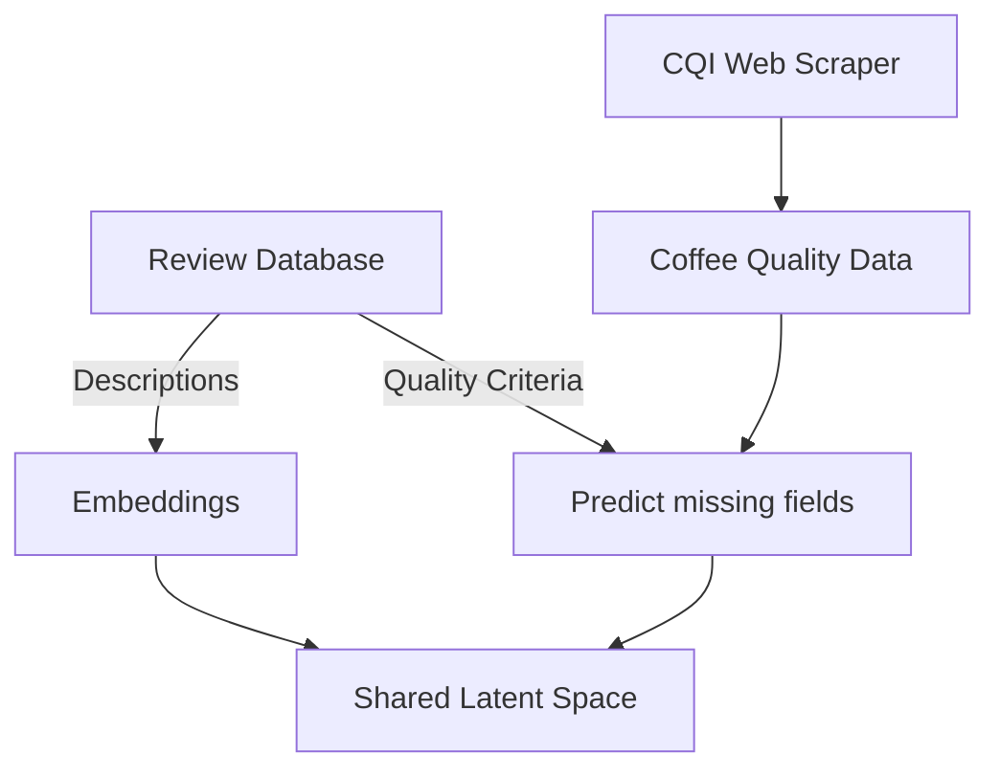

# From notebooks to pipelines to batch processing

Everybody loves notebooks, and by now, they can do just about everything: run code, show plots, [build website, publish packages](https://nbdev.fast.ai/) - you name it. Yet, there comes the time, when your project outgrows the notebook stage, when small-scale, interactive experiments have to be converted into automated, production-ready pipelines.

## What you will learn

- The basics of `Ploomber`, a tool for building data pipelines.
- The basics of `Airflow`, a scheduler batch processing.
- How to use the two to convert a notebook into a batch processing pipeline.

In this lab, you will learn about one way of converting a notebook-based experiment into a scalable pipeline.
We will start with a good old Jupyter Notebook. Then, you will be introduced to [Ploomber](https://docs.ploomber.io/en/latest/index.html), a framework for building collaborative and modular pipelines from notebooks. Once we have created a Ploomber pipeline, we will deploy it using airflow, a popular open-source workload scheduler.

## Required reading

To get you up to speed with Ploomber and Airflow we provide you with a short introduction to each of them.

| Required Reading |Link|
|:------------------:|:---|
| Ploombing 101 - Intro to Ploomber| [Click me](./ploomber/ploombing_101.md) |
| Venting 101 - Intro to Airflow | [Click me](./airflow/venting_101.md) |

## A multi-modal coffee pipeline

Now that you are an expert ploomber, you deserve a treat. What better than a cup of the superior caffeinated hot beverage - coffee! Life is too short for bad coffee. So, we want to find the best one.

There are a few quality criteria that one can evaluate:

- Aroma: Refers to the scent or fragrance of the coffee.
- Flavor: The flavor of coffee is evaluated based on the taste, including any sweetness, bitterness, acidity, and other flavor notes.
- Aftertaste: Refers to the lingering taste that remains in the mouth after swallowing the coffee.
- Acidity: Acidity in coffee refers to the brightness or liveliness of the taste.
- Body: The body of coffee refers to the thickness or viscosity of the coffee in the mouth.
- Balance: Balance refers to how well the different flavor components of the coffee work together.
- Uniformity: Uniformity refers to the consistency of the coffee from cup to cup.
- Clean Cup: A clean cup refers to a coffee that is free of any off-flavors or defects, such as sourness, mustiness, or staleness.
- Sweetness: It can be described as caramel-like, fruity, or floral, and is a desirable quality in coffee.

The Coffee Quality Institute (CQI) maintains a database about of coffee quality profiles and  [_somebody_](https://github.com/fatih-boyar/coffee-quality-data-CQI/tree/main) already wrote a web scraper for this data.

Your coffee-addicted (but only modestly data-science-skilled) friend also stumbled upon a database of coffee reviews, that include 5 of the 9 coffee quality criteria, along with text descriptions of the coffee. They even prepared the following pipeline, for which you can find a notebook in `lab02/coffe_analytics`:

However, your friend is getting tired of running the pipeline manually. You decide to help them out and build an automated data pipeline for them.

### Tasks

#### 1. From Notebook to Pipeline

Convert the notebook into a Ploomber pipeline. Make sure that the resulting pipeline has the same steps as the one in the diagram!

#### 2. ... from Pipeline to Batch Processing

Convert the Ploomber pipeline into an Airflow DAG.

You can use the [Soopervisor](https://soopervisor.readthedocs.io/en/latest/tutorials/airflow.html) tool for this! There are a couple of things to note:

- For this simple example, use the bash preset as it's the easiest one to debug.
- If you used `soorgeon` in the previous task, the (data) paths will be hardcoded. You will have to manually edit these paths to make the pipeline work.

Also, when debugging Airflow DAGs and tasks, there are a couple of handy features:

- Tasks generate logs.
- You can manually trigger DAGs by clicking the "Play button" in the DAG UI.
- You can manually restart tasks or whole subgraphs of a DAG by "clearing them" using the "Clear" submenu or "Clear task" button in the DAG.
