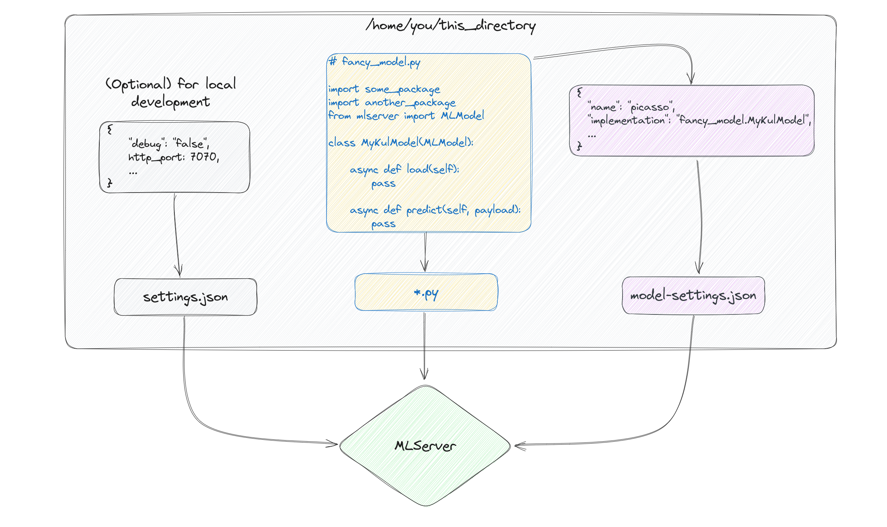

# Deploying models with `MLServer`

## Why do I even need a deployment server?

You might be wondering what speaks against loading your model with PyTorch, calling `.eval()`, and
wrapping everything in a FastAPI or Flask service.

This is undoubtedly a common approach, but there are a few considerations and potential drawbacks:

1. **Performance**: PyTorch is a powerful deep learning library, but it is not be the most efficient choice for serving predictions in a production environment, especially if the service needs to handle a large number of requests concurrently. While PyTorch can be optimized for inference, frameworks like [TensorFlow Serving](https://www.tensorflow.org/tfx/guide/serving) or [ONNX Runtime](https://onnxruntime.ai/) might offer better performance in certain scenarios.

2. **Resource Management**: Serving deep learning models requires careful resource management, especially memory usage and GPU utilization. In a production setting, it's essential to monitor resource usage and implement strategies such as batching to optimize performance and scalability. Purpose-built frameworks often already come with such tools built in.

3. **Deployment complexity**: While deploying a model with PyTorch and wrapping it in a web service using FastAPI or Flask is relatively straightforward, managing the deployment pipeline, versioning, and scaling can become complex, especially in large-scale production environments. Many serving frameworks come with dedicated model management solutions.

## Getting started with `MLServer`

In their own words,
> `MLServer` is an open-source library for building production-ready asynchronous APIs for machine learning models.

To get started, we first have to install `mlserver`. As with any other python package, you can do this using `pip`.

```shell
pip install mlserver
```

You don't have to run this because we have already taken care of it for you in the `env.yaml`.

### Setup

`MLServer` requires three things from its users:

- `model-settings.json`: This file provides information about the model.
- `settings.json`: This file is for information related to the server.
- `*.py`: A python script that declares how to load a model and how to make a prediction with it.

In a picture:



Let's get started. In the directory `tinyvit`, we have prepared an example for you.
We are building an inference server for a TinyViT vision transformer model that was trained on `ImageNet-22k`.
You can find the model on [huggingface hub](https://huggingface.co/timm/tiny_vit_5m_224.dist_in22k).

#### `*.py`

First, let us walk through the code in `serve-model.py`:

```python
class TinyViTModel(MLModel):

    async def load(self) -> bool:
        self._model = timm.create_model("tiny_vit_5m_224.dist_in22k", pretrained=True)
        self._model.eval()

        data_config = timm.data.resolve_data_config({}, model=self._model)
        self._transforms = timm.data.create_transform(**data_config, is_training=False)
        self.ready = True
        return self.ready

    @decode_args
    async def predict(self, payload: np.ndarray) -> np.ndarray:
        img = Image.fromarray(payload)
        img = self._transforms(img).unsqueeze(0)
        output = self._model(img)
        output = output.softmax(dim=1)
        return output.detach().numpy()
```

MLServer provides a base class for model's to inherit from. This base class, `MLModel`, exposes the
interface the MLServer uses to interact with models. The most important functions are
`load()`, `unload()`, and `predict()`.

The `load()` method is responsible for loading the model from a model artefact. For simplicity, we have chosen to pull a public model checkpoint
and save it in the class. We will look at alternatives to the former, and reasons for why the latter might be problematic, later in the lab.

The `predict` method is responsible for running inference on the model.

The way the methods are implemented shouldn't astonish you, it's really just what you can find
on the documentation page for [`tiny_vit_5m_224.dist_in22k`](https://huggingface.co/timm/tiny_vit_5m_224.dist_in22k).
What _is_ interesting is the `@decode_args` decorator just before `predict`.

Machine learning models generally expect their inputs to be passed as a particular type. These types range from common formats like NumPy arrays to more esoteric types like Pillow images (as is the case in our implementation). Clearly, a protocol like the one that `MLServer` uses cannot cover all possible Python types.

#### Excursion: Codecs

MLServer uses codecs to encapsulate the encoding and decoding logic for different data types. Codecs are an abstraction which know how to encode and decode high-level Python types. Here, MLServer follows the [Open Inference Protocol](https://docs.seldon.io/projects/seldon-core/en/latest/reference/apis/v2-protocol.html), an industry-wide effort to provide a standardized protocol to communicate with different inference servers and orchestrating frameworks.

Unless you want to use custom data types (which is not recommended unless you have a really good reason), you don't have to worry about codecs. MLServer comes with a set of built-in codecs that cover most common data types. The `@decode_args` decorator does the heavily lifting for you. Based on the information provided in the method signature, it will automatically decode the request payload and pass it to the method. It also takes care of encoding the response.

If you want to learn more about codecs, we recommend reading up on the [Open Inference Protocol](https://docs.seldon.io/projects/seldon-core/en/latest/reference/apis/v2-protocol.html) and the [MLServer documentation on codecs](https://mlserver.readthedocs.io/en/latest/user-guide/content-type.html).

#### `model-settings.json`

For now, the only other ingredient we require is `model-settings.json`.
This config file describes the model and provides `MLServer` with the necessary metadata.
Here is an example config for our model:

```json
{
    "name": "tinyvit",
    "implementation": "serve-model.TinyViTModel",
}
```

- `name` is the name of our model.
- `implementation` is the path where `MLServer` should look for the `MLModel` implementation.

There are many more settings you can set, and we will see some more later.
For a full list of options, refer to the [`MLServer` docs](https://mlserver.readthedocs.io/en/latest/reference/model-settings.html).

#### Running the server

Now that we have everything, let's run the server.
Open a terminal and navigate to the `lab07`. To start the server, run the following command:

```shell
mlserver start tinyvit
```

You should see output similar to the following:

```raw
❯ mlserver start tinyvit
2024-03-17 18:19:35,755 [mlserver.parallel] DEBUG - Starting response processing
 loop...
2024-03-17 18:19:35,755 [mlserver.rest] INFO - HTTP server running on http://0.0
.0.0:8080
INFO:     Started server process [41255]
INFO:     Waiting for application startup.
2024-03-17 18:19:35,770 [mlserver.metrics] INFO - Metrics server running on http
://0.0.0.0:8082
2024-03-17 18:19:35,770 [mlserver.metrics] INFO - Prometheus scraping endpoint c
an be accessed on http://0.0.0.0:8082/metrics
INFO:     Started server process [41255]
INFO:     Waiting for application startup.
INFO:     Application startup complete.
2024-03-17 18:19:37,481 [mlserver.grpc] INFO - gRPC server running on http://0.0
.0.0:8081
INFO:     Application startup complete.
INFO:     Uvicorn running on http://0.0.0.0:8080 (Press CTRL+C to quit)
INFO:     Uvicorn running on http://0.0.0.0:8082 (Press CTRL+C to quit)
2024-03-17 18:19:39,311 [mlserver][tinyvit] INFO - Loaded model 'tinyvit' succes
sfully.
2024-03-17 18:19:39,312 [mlserver][tinyvit] INFO - Loaded model 'tinyvit' succes
sfully.
```

 The route `v2/models/<model name>` serves model metadata. Navigate your browser to `http://localhost:8080/v2/models/tinyvit` or run

```shell
curl -X GET http://localhost:8080/v2/models/tinyvit
```

to check the `model-settings.json` we via the API.
The output should look like the JSON below:

```json
{"name":"tinyvit","versions":[],"platform":"","inputs":[],"outputs":[],"parameters":{}}
```

Awesome! In the next section we'll see how you can interact with the server via Python and the `MLServer` REST API.

### Testing the service

Time to become a client of our service and test it. For this, we’ll set up the payload with an image and send it to our service and use the `requests` library to `POST` our request.

To set up our payload, we will use the  `NumpyCodec` to encode the image.
`InferenceRequest` encodes a request for the service.

```python
from mlserver.codecs import NumpyCodec
from mlserver.types import InferenceRequest

input_data = ... # Your image goes here (as a numpy array).

inference_request = InferenceRequest(
    inputs=[
        NumpyCodec.encode_input(name="payload", payload=input_data)
    ]
)
```

To make requests to the `MLServer`, you can use the `POST` route `v2/models/<model name>/infer`.
Using the python library `requests`, the `inference_request` from above can be sent as follows:

```python
import requests


res = requests.post(inference_url, json=inference_request.dict())
```

If you have never worked with `requests`, you can learn more in the package documentation.
For a quick overview, check out the [DuckDuckGo Cheat Sheet](https://duckduckgo.com/?q=python+requests+cheat+sheet&t=newext&atb=v403-1&ia=cheatsheet&iax=1).

To access the response we get from `MLServer`, you can access the `JSON` as a Python dictionary:

```python
res.json()
```

#### Excursion: Where are the API docs?

You might be wondering where the API documentation is. Strangely, the `MLServer` docs don't mention it. 🤔
Well, there is actually no need for it! The API is standardized and follows the [Open Inference Protocol](https://docs.seldon.io/projects/seldon-core/en/latest/reference/apis/v2-protocol.html). What's more, the API is self-documenting. You can find the API documentation by navigating to `http://localhost:8080/v2/docs` (if you changed the port MLServer is listening on, adjust it accordingly) in your browser.

#### Your turn

You saw how to perform a request. Now it's your turn. Use the cat image in `lab07/imgs`,
send it to the server and inspect the response!

_Hint: Use PIL to read the image and then convert it to a NumPy array._

<details>
    <summary>Solution</summary>

```python
from mlserver.codecs import NumpyCodec
from mlserver.types import InferenceRequest
import numpy as np
from PIL import Image
import requests

inference_url = "http://localhost:8080/v2/models/tinyvit/infer"
input_data = np.array(Image.open("imgs/cat.jpg"))

inference_request = InferenceRequest(
    inputs=[
        NumpyCodec.encode_input(name="payload", payload=input_data)
    ]
)

res = requests.post(inference_url, json=inference_request.dict())
print(res.json())
```

</details>

---

#### Another turn

If you look at the output, more specifically `res.json()["outputs"][0]["data"]`,
you see that the response is not very useful without the model labels.

Modify the service to return the top 5 labels.

_Hint: You can find the labels in [`huggingface/label-files`](https://huggingface.co/datasets/huggingface/label-files/tree/main). The model was trained on ImageNet22k._

_Another Hint: Use `torch.topk` to obtain the top 5 labels. You can find an example [here](https://huggingface.co/timm/tiny_vit_5m_224.dist_in22k#image-classification)._

<details>
    <summary>Solution</summary>

The modified service:

```python
from mlserver import MLModel
from mlserver.codecs import decode_args
import numpy as np
from PIL import Image
import torch
import timm

import json
import os

class TinyViTModel(MLModel):
    
    def __init__(self, *args, **kwargs):
        super(TinyViTModel, self).__init__(*args, **kwargs)
        dirname = os.path.dirname(__file__)
        with open(f'{dirname}/imagenet-22k.json') as f:
            d = json.load(f)
        self.label_dict = d

    async def load(self) -> bool:
        self._model = timm.create_model("tiny_vit_5m_224.dist_in22k", pretrained=True)
        self._model.eval()

        data_config = timm.data.resolve_data_config({}, model=self._model)
        self._transforms = timm.data.create_transform(**data_config, is_training=False)
        self.ready = True
        return self.ready

    @decode_args
    async def predict(self, payload: np.ndarray) -> np.ndarray:
        img = Image.fromarray(payload)
        img = self._transforms(img).unsqueeze(0)
        output = self._model(img)
        _, top5_class_indices = torch.topk(output.softmax(dim=1) * 100, k=5)
        top5_classes = [self.label_dict[str(idx)] for idx in top5_class_indices.squeeze().tolist()]
        return np.array(top5_classes)   
```

</details>

### Interlude: MLServer Runtimes

**The below example is NOT WORKING as of Nov 2025**

**Please follow instead the transformer example provided at https://github.com/SeldonIO/MLServer/tree/master/docs/examples/huggingface**

So far, we've been writing our own services. However, `MLServer` comes with a range of runtimes built-in.
Inference runtimes allow you to define how your model should be used within `MLServer`.

`MLServer` runtimes are packaged in their own python packages. You can find a list of runtimes in the [`MLServer` documentation](https://mlserver.readthedocs.io/en/latest/runtimes/index.html#included-inference-runtimes). Runtimes are configured using `model-settings.json`.

Why use runtimes? It's a lot faster. The service we wrote above, translates to the following `model-settings.json`:

```json
{
    "name": "tinyvit",
    "implementation": "mlserver_huggingface.HuggingFaceRuntime",
    "parameters": {
        "extra": {
            "task": "image-classification",
            "pretrained_model": "tiny_vit_5m_224.dist_in22k"
        }
    }
}
```

Another benefit is that these runtimes often come with additional features, such as performance optimizations.
For instance, for the HuggingFace runtime, we can leverage the [Optimum library](https://huggingface.co/docs/optimum/index) using just a single simple config flag:

```json
{
    "name": "tinyvit",
    "implementation": "mlserver_huggingface.HuggingFaceRuntime",
    "parameters": {
        "extra": {
            "task": "image-classification",
            "pretrained_model": "tiny_vit_5m_224.dist_in22k",
            "optimum_model": true
        }
    }
}
```

If runtimes are so great, why would we not want to use them?
Well, there are frameworks that are not supported, e.g. PyTorch or Tensorflow (unless the model also is compatible with huggingface). Also, if you run the TinyViT model using the HuggingFace runtime,
you will get the response you obtained in the first version of the service. However, if you want to customize the output, you have to write your own service.

### Scaling our service

In the introduction, we contemplated that a service built around PyTorch wrapped in a rest API is difficult to scale.
`MLServer` comes with a range of features to scale your service and improve its performance.
We've previously mentioned that some runtimes offer optimized implementations.
Below, we will take a look at another two performance-enhancing features.

#### Parallel inference

Out of the box, `MLServer` offers support to offload inference workloads to a pool of workers running in separate processes.
This enables `MLServer` to scale beyond a single Python interpreter.


By default, `MLServer` spins up a pool with a single worker. To change this, we can set the `parallel_workers` field in
`settings.json`. This field controls the size of the inference pool.

```json
{
    "parallel_workers": 4
}
```

Setting `parallel_workers` to `N > 0`, will create a pool with `N` workers. `N = 0` disables the parallel inference feature
and all inference will happen within the main `MLServer` process.

Keep in mind that there is no free lunch! The main `MLServer` process and the inference pool worker workers communicate via an
Inter-Process Communication protocol. This introduces overhead into the system. You can learn more about Parallel Inference in the
[`MLServer` documentation](https://mlserver.readthedocs.io/en/latest/user-guide/parallel-inference.html#user-guide-parallel-inference--page-root).

#### Adaptive batching

`MLServer` includes a feature called adaptive batching. This feature allows `MLServer` to batch multiple requests together on the fly.
Why is this useful? There are two main reasons:

1. **Resource usage maximization**: GPU operations are vectorized. This means that these operations are designed to operate across batches. Batching requests together can help to maximize the utilization of the underlying hardware by  using its full capacity.
2. **Overhead minimization**: There is a constant overhead associated with processing each request. By batching requests together, we can amortize this overhead across multiple requests.

Again, there is no free lunch. These benefits only scale up to a certain point. This point is determined by the infrastructure, the model, the machine learning framework - and likely many other factors. As such, it is imperative to experiment with the settings to find the optimal configuration for your use case.

To enable adaptive batching, you can set the `max_batch_size` and `max_batch_time` fields in `settings.json`.

```json
{
    "max_batch_size": 4,
    "max_batch_time": 0.1
}
```

- **`max_batch_size`**: The maximum number of requests that can be batched together. `N > 1` enables adaptive batching. `N = 1` or `N = 0` disables adaptive batching.
- **`max_batch_time`**: The maximum time `MLServer` will wait for a batch to fill up before processing the batch. The expected value is in seconds. `T > 0` will wait `T` seconds at most. `T = 0` disables adaptive batching.

### Packaging up a service and shipping it

We can go one step further and package our service into a Docker container. This allows us to ship our service to any environment that supports Docker.

To do this, all we need is a `requirements.txt` file. This file should contain all the dependencies required to run our service. In our case, we can simply export the `env.yaml` file we used to create our environment and add it to `lab07/tinyvit`.

```shell
conda list -e > requirements.txt
```

Then, use `mlserver build` to build the Docker image.

```shell
mlserver build tinyvit/ -t tinyvit
```

where `tinyvit/` is the path to the directory containing the `model-settings.json` and `serve-model.py` files.
`-t` is the tag for the Docker image.

What do we do with the Docker image? We can run it locally, push it to a container registry, or deploy it to a cloud provider.
Even better, we can leverage some of the most popular Kubernetes serving frameworks to scale our service beyond a single machine!
We won't go into the details of how to do this in this lab, but you can find more information in the [`MLServer` documentation](https://mlserver.readthedocs.io/en/latest/user-guide/deployment/index.html). Maybe this is something you want to explore in your own projects. ;)

### Monitoring and logging

`MLServer` comes with built-in support for monitoring and logging. You can access metrics like request latency, request throughput, and more via a metrics API endpoint.

This endpoint serves data in what is known as the [`OpenMetrics`-format](https://openmetrics.io/). There are many tools that can consume this format, such as Prometheus and Grafana. We won't go into the details of how to set up these tools in this lab, but you can find more information in the [`MLServer` documentation](https://mlserver.readthedocs.io/en/latest/user-guide/metrics/index.html). Maybe this is again something for your own projects. :D
